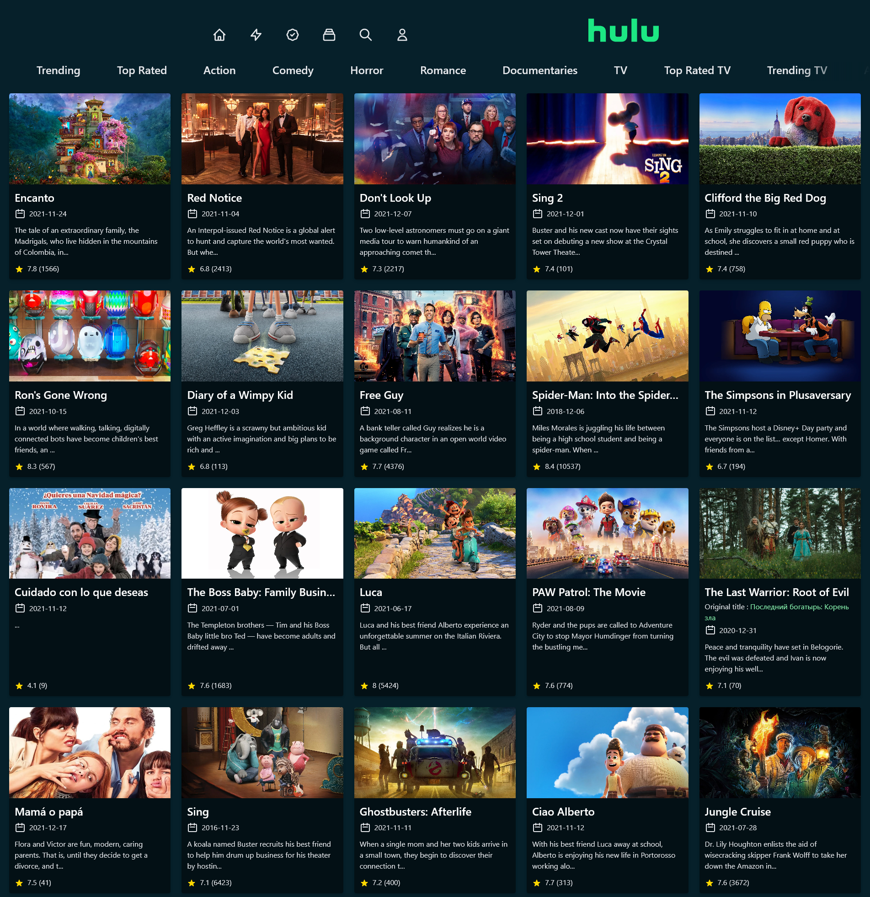
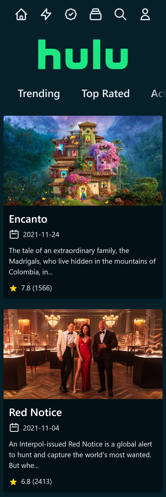

<!-- help me with readme -->

## Table of Contents

- [About](#about)
- [Features](#features)
- [Screenshots](#screenshots)
  - [Desktop](#home-screen)
  - [Mobile](#mobile)
- [Tech Stack](#tech-stack)
- [Run Locally](#run-locally)
- [Deployment](#deployment)
- [Feedback](#feedback)
- [Authors](#authors)
- [Contributers](#contributers)

## About

This is a simple clone of hulu website. It is built using Next.js and Tailwind CSS. It uses TMDB API to fetch movies and TV shows data. It is deployed on Vercel.

## Features

- Responsive
- Genre filter
- Search

## Screenshots

### Desktop



### Mobile



## Tech Stack

- Next.js
- Tailwind CSS
- TMDB API
- PostCSS
- Tailwind Scrollbar Hide (for hiding scrollbar)

## Run Locally

- Clone the project

```bash
	git clone https://github.com/therahulchaurasia/hulu-clone.git
```

- Go to the project directory

```bash
	cd hulu-clone
```

- Install dependencies

```bash
	npm install
```

- Start the server

```bash
	npm run dev
```

- Open [http://localhost:3000](http://localhost:3000) with your browser to see the result.
- Enjoy!

## Deployment

To deploy this project run

```bash
	npm run build
```

```bash
	npm run start
```

## Feedback

If you have any feedback, please reach out to me on [LinkedIn](https://linkedin.com/in/rahul-chaurasia-b60b4524b/)

## Authors

Rahul Chaurasia

- [LinkedIn](https://linkedin.com/in/rahul-chaurasia-b60b4524b/)
- [Github](https://github.com/therahulchaurasia/)
- [Instagram](https://www.instagram.com/rahulc_3/)

## Contributers

- [@thesohailjafri](https://github.com/thesohailjafri/)

Thanks to these wonderful people ✨✨:
